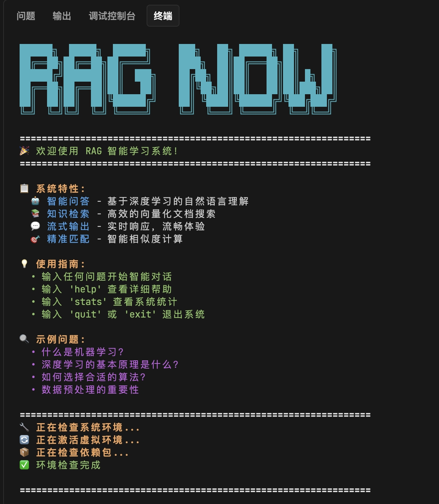

# RAG学习系统 - 智能问答系统

[](README.md)
[](https://python.org)
[](LICENSE)
[](README.md)
[](https://trae.ai)
[](https://claude.ai)
[](SPEC_RAG学习系统_v1.0.md)
[](README.md)
[](https://www.deepseek.com/)
[](https://github.com/facebookresearch/faiss)
[](https://huggingface.co/BAAI/bge-small-zh-v1.5)
[](README.md)
[](README.md)
[](README.md)

## 🚀 系统启动界面



*RAG 智能学习系统启动界面 - 展示系统特性、使用指南和示例问题*

一个基于检索增强生成（RAG）技术的智能问答系统，专为中文学习场景优化设计。支持Markdown文档的智能索引和检索，提供高质量的AI问答体验。

## 🌟 项目特色

- **🇨🇳 中文优化**: 使用专门的中文嵌入模型 `BAAI/bge-small-zh-v1.5`
- **🤖 智能对话**: 集成 DeepSeek API 提供高质量的对话生成
- **📚 文档处理**: 支持 Markdown 文档的智能分块和索引
- **🔍 精准检索**: 基于 FAISS 的高效向量检索
- **⚡ 相似度过滤**: 智能阈值过滤，确保回答质量
- **🛠️ 灵活配置**: 支持 YAML 配置文件和环境变量
- **📊 详细日志**: 完整的操作日志和性能监控
- **🚀 高性能**: 支持批量处理和缓存机制

## 🛠️ 开发方法论

本项目采用了 **SDD (Software Development Document) 开发方法论**，通过标准化的文档驱动开发流程，确保项目的高质量交付。

### 📚 SDD Agent 系统

本项目的开发过程使用了 [SDD-Agent-Prompt](https://github.com/Coldplay-now/SDD-Agent-Prompt) <mcreference link="https://github.com/Coldplay-now/SDD-Agent-Prompt" index="0">0</mcreference> 项目提供的专业化 AI Agent 系统，实现了从需求分析到任务分解的完整开发流程：

- **🎯 需求构建 Agent**: 智能识别和处理需求中的噪音与缺口，生成结构化的产品需求文档 <mcreference link="https://github.com/Coldplay-now/SDD-Agent-Prompt" index="0">0</mcreference>
- **📊 需求评估 Agent**: 严格评估 PRD 文档的"低噪音"质量，消除歧义和冗余 <mcreference link="https://github.com/Coldplay-now/SDD-Agent-Prompt" index="0">0</mcreference>
- **⚙️ 技术规格 Agent**: 将 PRD 转换为详细的技术实现规格，包含架构设计和技术选型 <mcreference link="https://github.com/Coldplay-now/SDD-Agent-Prompt" index="0">0</mcreference>
- **📋 任务分解 Agent**: 将技术规格分解为具体的开发任务，进行智能任务分解和依赖关系分析 <mcreference link="https://github.com/Coldplay-now/SDD-Agent-Prompt" index="0">0</mcreference>

### 🔄 开发流程

```mermaid
graph TD
    A[原始需求] --> B[需求构建Agent]
    B --> C[产品需求文档]
    C --> H[需求评估Agent]
    H --> I[评估报告 & 改进建议]
    I --> C
    C --> D[技术规格构建Agent]
    D --> E[技术规格文档]
    E --> F[任务列表构建Agent]
    F --> G[详细开发任务列表]
```



通过这套 SDD 方法论，本项目实现了：
- **🔍 智能需求分析**: 自动识别和处理需求中的噪音与缺口 <mcreference link="https://github.com/Coldplay-now/SDD-Agent-Prompt" index="0">0</mcreference>
- **📝 自动文档生成**: 智能生成 PRD 和技术规格文档 <mcreference link="https://github.com/Coldplay-now/SDD-Agent-Prompt" index="0">0</mcreference>
- **⚡ 高效任务分解**: 将复杂项目分解为可执行的任务列表 <mcreference link="https://github.com/Coldplay-now/SDD-Agent-Prompt" index="0">0</mcreference>
- **🤖 流程标准化**: 建立可复用的软件开发工作流程 <mcreference link="https://github.com/Coldplay-now/SDD-Agent-Prompt" index="0">0</mcreference>

## 📋 项目文档

本项目提供了完整的项目管理和技术文档，帮助您深入了解系统设计和开发过程：

### 📄 核心文档

#### 1. [产品需求文档 (PRD)](SDD/PRD_RAG学习系统_v1.0.md)
- **文档价值**: 完整定义了RAG学习系统的产品愿景、功能需求和用户体验设计
- **主要内容**: 
  - 产品概述与目标用户分析
  - 详细功能需求规格说明
  - 用户界面设计与交互流程
  - 性能指标与质量标准
- **适用人群**: 产品经理、项目负责人、开发团队成员
- **使用场景**: 项目规划、需求评审、功能验收

#### 2. [系统设计文档 (SPEC)](SDD/SPEC_RAG学习系统_简化版_v1.0.md)
- **文档价值**: 提供了系统的技术架构设计和实现方案，是开发的技术蓝图
- **主要内容**:
  - 系统整体架构设计
  - 核心模块技术实现方案
  - 数据流程与接口设计
  - 技术选型与依赖管理
- **适用人群**: 架构师、开发工程师、技术负责人
- **使用场景**: 技术评审、代码开发、系统维护

#### 3. [任务清单 (TaskList)](SDD/TaskList_RAG学习系统_v1.0.md)
- **文档价值**: 详细的开发任务分解和进度管理，确保项目有序推进
- **主要内容**:
  - 开发任务分解与优先级
  - 里程碑规划与时间安排
  - 风险识别与应对策略
  - 质量保证与测试计划
- **适用人群**: 项目经理、开发团队、测试团队
- **使用场景**: 项目管理、进度跟踪、任务分配

### 📚 文档使用指南

这三个文档构成了完整的项目管理体系：

1. **开发前**: 阅读PRD了解产品需求，参考SPEC进行技术设计
2. **开发中**: 按照TaskList执行开发任务，遵循SPEC的技术规范
3. **开发后**: 对照PRD进行功能验收，确保满足产品要求

### 🔄 文档维护

- 所有文档均采用Markdown格式，便于版本控制和协作编辑
- 文档版本与代码版本同步更新，确保一致性
- 支持通过Git进行文档变更追踪和团队协作

## 🏗️ 系统架构

### 核心模块

```
┌─────────────────┐    ┌─────────────────┐    ┌─────────────────┐
│ DocumentProcessor│    │ EmbeddingModel  │    │   ChatService   │
│                 │    │                 │    │                 │
│ • Markdown解析  │    │ • SentenceTransformer│ • DeepSeek API  │
│ • 内容分块      │    │ • 向量生成      │    │ • 流式输出      │
│ • 元数据提取    │    │ • 批量处理      │    │ • 上下文管理    │
└─────────────────┘    └─────────────────┘    └─────────────────┘
         │                       │                       │
         └───────────────────────┼───────────────────────┘
                                 │
                    ┌─────────────────┐
                    │ ConfigManager   │
                    │                 │
                    │ • Config类管理  │
                    │ • 环境变量加载  │
                    │ • 参数验证      │
                    └─────────────────┘
                                 │
                    ┌─────────────────┐    ┌─────────────────┐
                    │   VectorStore   │    │  RAGRetriever   │
                    │                 │    │                 │
                    │ • FAISS索引     │    │ • 相似度检索    │
                    │ • 向量存储      │    │ • 结果排序      │
                    │ • 索引管理      │    │ • 阈值过滤      │
                    └─────────────────┘    └─────────────────┘
```

### 数据流程

以下是 RAG 系统的完整数据流程时序图，展示了从系统启动到问答循环的详细交互过程：

```mermaid
sequenceDiagram
    participant U as 用户
    participant M as main.py
    participant CM as ConfigManager
    participant DP as DocumentProcessor
    participant EM as EmbeddingModel
    participant VS as VectorStore
    participant RT as RAGRetriever
    participant CS as ChatService
    
    U->>M: 启动系统
    M->>CM: 加载配置
    M->>EM: 初始化嵌入模型
    M->>DP: 加载文档
    DP->>EM: 文档分块向量化
    EM->>VS: 构建FAISS向量索引
    M->>RT: 初始化RAG检索器
    M->>CS: 初始化对话服务
    
    loop 问答循环
        U->>M: 输入问题
        M->>CS: 生成答案（流式）
        CS->>RT: 检索相关文档
        RT->>VS: 向量相似度搜索
        VS-->>RT: 返回检索结果
        RT-->>CS: 传递检索结果
        CS->>CS: 调用DeepSeek API生成回答
        CS-->>M: 流式返回答案
        M->>U: 实时显示结果
    end
```



**流程说明**：
1. **系统初始化阶段**：加载配置、初始化各个组件、构建向量索引
2. **问答循环阶段**：接收用户问题、检索相关文档、生成并流式输出答案
3. **核心特性**：支持流式输出、实时反馈、高效向量检索

## 📋 系统要求

### 硬件要求
- **CPU**: 2核心以上（推荐4核心）
- **内存**: 最低4GB，推荐8GB以上
- **存储**: 至少2GB可用空间
- **网络**: 稳定的互联网连接（用于API调用）

### 软件要求
- **Python**: 3.8+ （推荐3.10+）
- **操作系统**: Windows 10+, macOS 10.14+, Ubuntu 18.04+
- **DeepSeek API**: 有效的API密钥

## 🚀 快速开始

### 1. 环境准备

#### 克隆项目
```bash
git clone <repository-url>
cd rag_learning_system
```

#### 检查Python版本
```bash
python --version  # 确保是3.8+
```

### 2. 虚拟环境设置

#### 创建虚拟环境
```bash
# 使用venv（推荐）
python -m venv venv

# 或使用conda
conda create -n rag_system python=3.10
```

#### 激活虚拟环境
```bash
# Linux/Mac
source venv/bin/activate

# Windows
venv\Scripts\activate

# Conda
conda activate rag_system
```

### 3. 依赖安装

#### 安装核心依赖
```bash
pip install -r requirements.txt
```

#### 验证安装
```bash
python -c "import sentence_transformers, faiss, requests; print('所有依赖安装成功！')"
```

### 4. 配置设置

系统使用环境变量进行配置：

```bash
# 复制环境变量模板
cp .env.example .env

# 编辑环境变量
nano .env
```

配置示例：
```bash
# DeepSeek API配置
DEEPSEEK_API_KEY=your_deepseek_api_key_here

# 嵌入模型配置
EMBEDDING_MODEL_NAME=BAAI/bge-small-zh-v1.5
EMBEDDING_DEVICE=cpu

# 文档处理配置
CHUNK_SIZE=1000
CHUNK_OVERLAP=200

# 检索配置
TOP_K=5
SIMILARITY_THRESHOLD=0.3

# LLM配置
LLM_MODEL=deepseek-chat
LLM_TEMPERATURE=0.7
LLM_MAX_TOKENS=1000
LLM_STREAM=true

# 路径配置
DOCUMENTS_PATH=./data/documents
VECTORS_PATH=./data/vectors
```

#### 获取DeepSeek API密钥
1. 访问 [DeepSeek官网](https://www.deepseek.com/)
2. 注册账号并登录
3. 进入API管理页面
4. 创建新的API密钥
5. 将密钥复制到.env文件中

### 5. 文档准备

#### 创建文档目录
```bash
mkdir -p data/documents
mkdir -p data/vectors
```

#### 添加文档
```bash
# 将您的Markdown文档复制到documents目录
cp your_documents.md data/documents/
```

#### 支持的文档格式
- ✅ Markdown (.md)
- ❌ PDF（暂不支持）
- ❌ Word文档（暂不支持）
- ❌ 纯文本（暂不支持）

### 6. 启动系统

#### 首次启动
```bash
python main.py
```

#### 系统初始化过程
1. 加载配置文件
2. 初始化嵌入模型（首次会下载模型）
3. 处理文档并建立索引
4. 启动交互界面

## 📖 详细使用指南

### 基本操作

启动系统后，您将看到交互式界面：

```
🚀 RAG学习系统启动成功！
📚 已加载 5 个文档，共 1,234 个文档块
🤔 请输入您的问题（输入 'help' 查看帮助）:
```

#### 可用命令
- **普通提问**: 直接输入问题
- **help**: 显示帮助信息
- **stats**: 查看系统统计信息
- **config**: 显示当前配置
- **reload**: 重新加载文档
- **clear**: 清屏
- **quit/exit**: 退出系统

### 示例对话

```
🤔 请输入您的问题: 什么是机器学习？

🔍 正在检索相关文档...
🤖 正在生成回答...

💡 回答:
机器学习是人工智能的一个重要分支，它使计算机能够在没有明确编程的情况下学习和改进性能。
机器学习算法通过分析大量数据来识别模式，并使用这些模式对新数据进行预测或决策。

主要类型包括：
1. 监督学习：使用标记数据训练模型
2. 无监督学习：从未标记数据中发现模式
3. 强化学习：通过试错学习最优策略

📚 参考来源: 
  - ai_basics.md (相似度: 0.856)
  - machine_learning_intro.md (相似度: 0.742)

🎯 置信度: 高
⏱️  响应时间: 2.34秒
💾 使用缓存: 否
```

### 高级功能

#### 1. 批量问答
```bash
# 创建问题文件
echo "什么是深度学习？
什么是神经网络？
什么是自然语言处理？" > questions.txt

# 运行批量测试
python comprehensive_test.py --input questions.txt
```

#### 2. 性能测试
```bash
# 测试检索性能
python test_similarity_threshold.py

# 测试交互性能
python test_interaction.py
```

## ⚙️ 配置详解

### Config类配置结构

系统使用Config类管理所有配置，通过环境变量进行设置：

```python
@dataclass
class Config:
    # 嵌入模型配置
    embedding_model_name: str = "BAAI/bge-small-zh-v1.5"
    embedding_device: str = "cpu"
    
    # 文档处理配置
    chunk_size: int = 1000
    chunk_overlap: int = 200
    
    # 检索配置
    top_k: int = 5
    similarity_threshold: float = 0.3
    
    # LLM配置
    llm_model: str = "deepseek-chat"
    llm_temperature: float = 0.7
    llm_max_tokens: int = 1000
    llm_stream: bool = True
    
    # 路径配置
    documents_path: str = "./data/documents"
    vectors_path: str = "./data/vectors"
    
    # API配置
    deepseek_api_key: str = ""
```

### 环境变量配置

```bash
# 嵌入模型配置
EMBEDDING_MODEL_NAME=BAAI/bge-small-zh-v1.5  # 中文嵌入模型
EMBEDDING_DEVICE=cpu                          # 设备类型: cpu/cuda

# 文档处理配置
CHUNK_SIZE=1000                              # 文档分块大小（字符）
CHUNK_OVERLAP=200                            # 分块重叠长度

# 检索配置
TOP_K=5                                      # 检索结果数量
SIMILARITY_THRESHOLD=0.3                     # 相似度阈值

# 对话模型配置
LLM_MODEL=deepseek-chat                      # 模型名称
LLM_TEMPERATURE=0.7                          # 生成温度
LLM_MAX_TOKENS=1000                          # 最大生成长度
LLM_STREAM=true                              # 是否流式输出

# 路径配置
DOCUMENTS_PATH=./data/documents              # 文档目录
VECTORS_PATH=./data/vectors                  # 向量索引目录

# API配置
DEEPSEEK_API_KEY=your_api_key_here          # DeepSeek API密钥
```

### 参数调优指南

#### 相似度阈值调优
- **0.1-0.3**: 宽松过滤，返回更多结果，适合探索性问答
- **0.3-0.5**: 平衡过滤，推荐设置，适合一般问答
- **0.5-0.7**: 严格过滤，高质量结果，适合专业问答
- **>0.7**: 极严格过滤，可能过度限制结果

#### 性能优化参数
- **chunk_size**: 影响检索精度（短文档用500-800，长文档用1000-1500）
- **chunk_overlap**: 影响上下文连续性（一般设置为chunk_size的10-20%）
- **top_k**: 影响检索速度（一般3-10即可）
- **similarity_threshold**: 影响检索质量（根据实际效果调整）

## 🧪 测试功能

### 1. 综合功能测试
```bash
# 运行所有测试
python comprehensive_test.py

# 运行特定测试
python comprehensive_test.py --test embedding
python comprehensive_test.py --test retrieval
python comprehensive_test.py --test chat
```

### 2. 相似度阈值测试
```bash
# 测试不同阈值效果
python test_similarity_threshold.py

# 自定义阈值测试
python test_similarity_threshold.py --threshold 0.4
```

### 3. 交互性能测试
```bash
# 交互测试
python test_interaction.py

# 批量问答测试
python test_interaction.py --batch questions.txt
```

### 4. 单元测试
```bash
# 测试文档处理
python test_document_processor.py

# 测试嵌入服务
python test_embedding_service.py

# 测试对话服务
python test_chat_service.py
```

## 📊 性能基准

### 测试环境
- **CPU**: Intel i7-10700K
- **内存**: 16GB DDR4
- **Python**: 3.10.12
- **文档数量**: 50个Markdown文件
- **总文档块**: 2,500个

### 性能指标

| 操作 | 平均时间 | 内存使用 | 备注 |
|------|----------|----------|------|
| 模型加载 | 15.2秒 | 1.2GB | 首次启动 |
| 文档索引 | 8.7秒 | 800MB | 50个文档 |
| 单次检索 | 0.15秒 | +50MB | Top-5结果 |
| 对话生成 | 2.3秒 | +100MB | 平均长度 |
| 缓存命中 | 0.02秒 | +10MB | 缓存检索 |

### 扩展性测试

| 文档数量 | 索引时间 | 检索时间 | 内存使用 |
|----------|----------|----------|----------|
| 10 | 1.8秒 | 0.08秒 | 400MB |
| 50 | 8.7秒 | 0.15秒 | 800MB |
| 100 | 17.2秒 | 0.28秒 | 1.5GB |
| 500 | 85.6秒 | 1.2秒 | 6.8GB |

## 🔧 开发指南

### 项目结构详解

```
rag_learning_system/
├── src/                              # 核心源代码
│   ├── __init__.py                   # 包初始化
│   ├── config_manager.py             # 配置管理模块
│   ├── document_processor.py         # 文档处理模块（Markdown解析、分块）
│   ├── embedding_model.py            # 嵌入模型模块（SentenceTransformer）
│   ├── embedding_service.py          # 嵌入服务模块
│   ├── vector_store.py               # 向量存储模块（FAISS索引）
│   ├── retriever.py                  # RAG检索模块
│   └── chat_service.py              # 对话服务模块（DeepSeek API集成）
├── data/                             # 数据目录
│   ├── documents/                   # 原始文档存储
│   └── vectors/                     # 向量索引文件
├── tests/                            # 测试脚本目录
│   ├── test_*.py                    # 单元测试文件
│   ├── comprehensive_test.py        # 综合测试
│   ├── auto_test.py                 # 自动化测试
│   └── test_interaction.py          # 交互测试
├── SDD/                              # 软件设计文档目录
│   ├── PRD_RAG学习系统_v1.0.md       # 产品需求文档
│   ├── SPEC_RAG学习系统_简化版_v1.0.md # 系统设计文档
│   └── TaskList_RAG学习系统_v1.0.md   # 任务清单文档
├── .env                             # 环境变量
├── .env.example                     # 环境变量模板
├── config.yaml                      # 配置文件
├── requirements.txt                 # Python依赖
├── main.py                          # 主程序入口
├── start_rag.sh                     # 启动脚本
└── README.md                        # 项目文档
```

### 扩展开发

#### 1. 添加新的文档处理器
```python
from src.document_processor import MarkdownDocumentProcessor

class PDFDocumentProcessor:
    """PDF文档处理器示例"""
    
    def process_document(self, file_path: str) -> List[str]:
        """处理PDF文档"""
        # 实现PDF解析逻辑
        pass
    
    def extract_metadata(self, file_path: str) -> Dict:
        """提取PDF元数据"""
        # 实现元数据提取
        pass
```

#### 2. 自定义检索策略
```python
from src.retriever import RAGRetriever

class HybridRetriever(RAGRetriever):
    """混合检索器示例"""
    
    def search(self, query: str, **kwargs):
        """实现混合检索（向量+关键词）"""
        # 向量检索
        vector_results = super().search(query, **kwargs)
        
        # 关键词检索
        keyword_results = self.keyword_search(query)
        
        # 结果融合
        return self.merge_results(vector_results, keyword_results)
```

#### 3. 添加新的LLM支持
```python
from src.chat_service import ChatService

class CustomLLMService:
    """自定义LLM服务示例"""
    
    def generate_response(self, prompt: str, context: List[str]) -> str:
        """使用自定义LLM生成回答"""
        # 实现自定义LLM调用逻辑
        pass
```

## 🐛 故障排除

### 常见问题及解决方案

#### 0. 依赖版本兼容性

**问题**: 旧版本依赖导致的兼容性问题
```bash
cannot import name 'cached_download' from 'huggingface_hub'
TypeError: unexpected keyword argument 'proxies'
```
**解决方案**:
```bash
# 升级核心依赖到最新兼容版本
pip install --upgrade sentence-transformers  # 升级到 5.1.0+
pip install --upgrade openai                 # 升级到 1.108.1+

# 或者重新安装所有依赖
pip install -r requirements.txt --upgrade
```

**说明**: 系统已更新到以下版本以确保兼容性：
- `sentence-transformers==5.1.0` (解决 huggingface_hub 兼容性问题)
- `openai==1.108.1` (解决 API 调用参数兼容性问题)

#### 1. 安装问题

**问题**: `pip install` 失败
```bash
ERROR: Could not find a version that satisfies the requirement sentence-transformers
```
**解决方案**:
```bash
# 升级pip
pip install --upgrade pip

# 使用国内镜像
pip install -r requirements.txt -i https://pypi.tuna.tsinghua.edu.cn/simple/

# 分步安装
pip install torch torchvision torchaudio
pip install sentence-transformers
pip install faiss-cpu
```

**问题**: FAISS安装失败
```bash
ERROR: Failed building wheel for faiss-cpu
```
**解决方案**:
```bash
# macOS
brew install libomp
pip install faiss-cpu

# Ubuntu
sudo apt-get install libomp-dev
pip install faiss-cpu

# Windows
pip install faiss-cpu --no-cache-dir
```

#### 2. 模型加载问题

**问题**: 嵌入模型下载失败
```bash
ConnectionError: Failed to download model
```
**解决方案**:
```bash
# 设置镜像源
export HF_ENDPOINT=https://hf-mirror.com

# 手动下载模型
python -c "from sentence_transformers import SentenceTransformer; SentenceTransformer('BAAI/bge-small-zh-v1.5')"

# 使用本地模型
# 修改config.yaml中的model_name为本地路径
```

**问题**: 模型加载内存不足
```bash
RuntimeError: CUDA out of memory
```
**解决方案**:
```bash
# 修改.env文件
echo "EMBEDDING_DEVICE=cpu" >> .env  # 改为CPU
```

#### 3. API调用问题

**问题**: DeepSeek API密钥错误
```bash
AuthenticationError: Invalid API key
```
**解决方案**:
```bash
# 检查.env文件
cat .env | grep DEEPSEEK_API_KEY

# 重新设置API密钥
echo "DEEPSEEK_API_KEY=your_new_key" >> .env

# 验证API密钥
curl -H "Authorization: Bearer your_api_key" https://api.deepseek.com/v1/models
```

**问题**: API请求超时
```bash
TimeoutError: Request timed out
```
**解决方案**:
```bash
# 修改config.yaml
llm:
  timeout: 60  # 增加超时时间
  
# 或在.env中设置
echo "REQUEST_TIMEOUT=60" >> .env
```

#### 4. 检索问题

**问题**: 检索结果为空
```bash
Warning: No relevant documents found
```
**解决方案**:
```bash
# 降低相似度阈值
echo "SIMILARITY_THRESHOLD=0.1" >> .env  # 降低阈值

# 检查文档内容
ls -la data/documents/
python -c "from src.document_processor import MarkdownDocumentProcessor; dp = MarkdownDocumentProcessor(); print('文档处理器已加载')"
```

**问题**: 检索速度慢
```bash
Warning: Retrieval taking too long
```
**解决方案**:
```bash
# 优化配置
echo "TOP_K=3" >> .env        # 减少检索数量
```

#### 5. 性能问题

**问题**: 内存使用过高
```bash
MemoryError: Unable to allocate memory
```
**解决方案**:
```bash
# 使用CPU设备
echo "EMBEDDING_DEVICE=cpu" >> .env

# 减少文档分块大小
echo "CHUNK_SIZE=500" >> .env
```

**问题**: 启动速度慢
```bash
System taking too long to start
```
**解决方案**:
```bash
# 预加载模型
python -c "from src.embedding_model import EmbeddingModel; EmbeddingModel()"
```

### 日志分析

#### 查看系统日志
```bash
# 查看最新日志
tail -f rag_system.log

# 查看错误日志
grep "ERROR" rag_system.log

# 查看性能日志
grep "Performance" rag_system.log
```

#### 日志级别说明
- **DEBUG**: 详细调试信息
- **INFO**: 一般信息
- **WARNING**: 警告信息
- **ERROR**: 错误信息
- **CRITICAL**: 严重错误

### 性能监控

#### 系统资源监控
```bash
# 监控内存使用
python -c "
import psutil
import time
while True:
    print(f'Memory: {psutil.virtual_memory().percent}%')
    time.sleep(5)
"

# 监控GPU使用（如果有）
nvidia-smi -l 5
```

#### 应用性能监控
```bash
# 查看配置信息
python -c "
from src.config_manager import ConfigManager
config = ConfigManager()
print(f'嵌入模型: {config.embedding_model_name}')
print(f'分块大小: {config.chunk_size}')
print(f'检索数量: {config.top_k}')
"
```

## 🤝 贡献指南

### 开发环境设置

1. **Fork项目**
```bash
git clone https://github.com/your-username/rag_learning_system.git
cd rag_learning_system
```

2. **创建开发分支**
```bash
git checkout -b feature/your-feature-name
```

3. **安装开发依赖**
```bash
pip install -r requirements-dev.txt
```

4. **运行测试**
```bash
python -m pytest tests/
```

### 代码规范

- 使用Python 3.8+语法
- 遵循PEP 8代码风格
- 添加类型注解
- 编写单元测试
- 更新文档

### 提交流程

1. 确保所有测试通过
2. 更新相关文档
3. 提交代码并推送
4. 创建Pull Request

## 📄 许可证

本项目采用 MIT 许可证 - 查看 [LICENSE](LICENSE) 文件了解详情。

## 🙏 致谢

- [BAAI/bge-small-zh-v1.5](https://huggingface.co/BAAI/bge-small-zh-v1.5) - 优秀的中文嵌入模型
- [DeepSeek](https://www.deepseek.com/) - 强大的对话生成API
- [FAISS](https://github.com/facebookresearch/faiss) - 高效的向量检索引擎
- [Sentence Transformers](https://www.sbert.net/) - 易用的句子嵌入库
- [OpenAI](https://openai.com/) - API接口标准

## 📞 联系方式

如有问题或建议，请通过以下方式联系：

- 📧 **邮箱**: [your-email@example.com]
- 🐛 **问题反馈**: [GitHub Issues](https://github.com/your-repo/issues)
- 💬 **讨论**: [GitHub Discussions](https://github.com/your-repo/discussions)
- 📖 **文档**: [项目Wiki](https://github.com/your-repo/wiki)

## 🔗 相关链接

- [RAG技术原理](https://arxiv.org/abs/2005.11401)
- [中文NLP资源](https://github.com/didi/ChineseNLP)
- [向量数据库对比](https://github.com/erikbern/ann-benchmarks)
- [LLM评测基准](https://github.com/THUDM/GLM-Eval)

---

**RAG学习系统** - 让知识检索更智能，让学习更高效 🚀

*最后更新: 2024年1月*