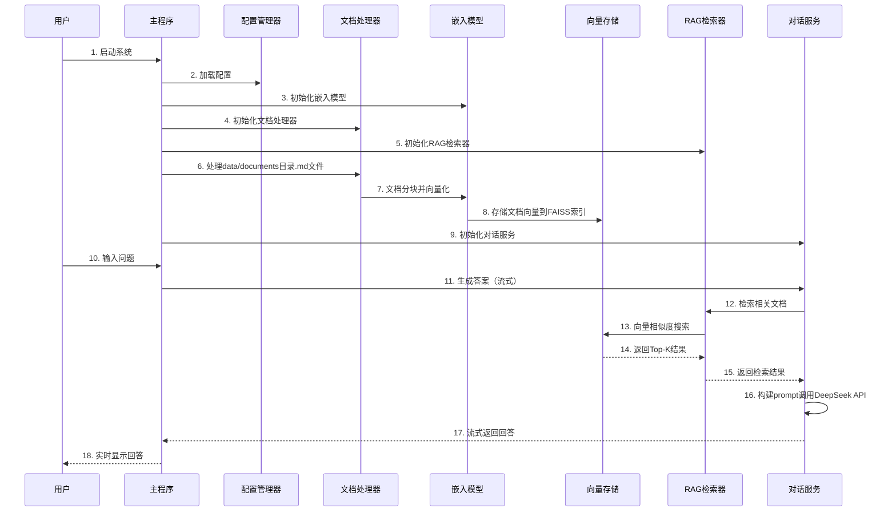
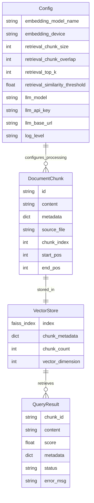

# 产品需求文档 (PRD) - RAG学习系统

## 1. 项目概述
- **项目名称**: RAG智能问答学习系统
- **项目目标**: 构建一个用于学习RAG核心原理的智能问答系统，完整覆盖从文档处理到智能问答的基本流程
- **目标用户**: RAG技术学习者、AI开发初学者
- **核心价值**: 提供完整的RAG技术实践平台，帮助学习者理解从文档处理到问答生成的全流程
- **项目状态**: 已完成MVP版本，系统可正常运行
- **最新更新**: 已升级核心依赖库版本以确保兼容性（sentence-transformers 5.1.0, openai 1.108.1）

## 2. 需求边界与约束
- **功能边界**: 
  - 已实现：完整RAG流程（文档加载→向量化→检索→生成回答）、支持中文问答、命令行交互、流式输出、配置管理
  - 不包含：Web界面、用户管理、复杂的重排序算法、多格式文档支持
- **技术约束**: 
  - Python 3.11 + venv虚拟环境
  - 仅支持.md格式文档
  - 本地BAAI/bge-small-zh-v1.5嵌入模型
  - FAISS向量数据库（IndexFlatIP）
  - DeepSeek API (deepseek-chat模型，OpenAI格式调用)
  - 核心依赖版本：sentence-transformers==5.1.0, openai==1.108.1
  - 配置管理：统一config.yaml配置文件 + 环境变量覆盖
  - 错误处理：完善的异常处理 + 用户友好提示
- **资源约束**: 
  - 开发完成
  - 人力：1人
  - 预算：API调用费用
- **合规约束**: API密钥安全存储、代码注释中文化

## 3. 系统架构与数据模型

### 核心业务流程时序图



### 数据模型



## 4. 功能需求 (P0/P1/P2分级)

### P0需求 (核心功能，必须实现)

#### P0-001: 文档加载与处理
- **需求描述**: 作为学习者，我希望系统能够自动加载doc目录下的所有.md文件，以便进行后续的向量化处理
- **验收标准**: 
  - 能够扫描并加载doc目录下所有.md文件
  - 支持中文内容读取
  - 文档内容智能分块（500字符，重叠50字符）
  - 基础错误处理（文件不存在、编码错误等）
- **依赖关系**: 无

#### P0-002: 文档向量化
- **需求描述**: 作为学习者，我希望系统使用bge-small-zh模型将文档内容转换为向量，以便进行相似度检索
- **验收标准**:
  - 成功加载bge-small-zh本地模型
  - 将文档分块转换为768维向量
  - 向量化过程有进度提示
- **依赖关系**: P0-001

#### P0-003: 向量存储与检索
- **需求描述**: 作为学习者，我希望系统使用FAISS存储文档向量并支持快速检索，以便找到相关文档片段
- **验收标准**:
  - 使用FAISS IndexFlatIP实现余弦相似度搜索
  - 支持Top-K检索（默认K=3）
  - 检索结果包含相似度分数
- **依赖关系**: P0-002

#### P0-004: 问答生成
- **需求描述**: 作为学习者，我希望系统调用DeepSeek API基于检索到的文档片段生成回答，以便获得准确的问答结果
- **验收标准**:
  - 使用deepseek-chat模型，OpenAI格式调用
  - 支持流式响应显示
  - 回答基于检索到的文档内容
  - API调用错误处理（网络异常、配额超限等）
- **依赖关系**: P0-003

#### P0-005: 命令行交互界面
- **需求描述**: 作为学习者，我希望通过简洁的命令行界面与系统交互，以便方便地进行问答操作
- **验收标准**:
  - 支持中文问题输入
  - 实时显示回答过程
  - 支持退出命令
- **依赝关系**: P0-004

### P1需求 (重要功能)

#### P1-001: 配置管理
- **需求描述**: 作为学习者，我希望通过配置文件管理系统参数，以便灵活调整系统行为
- **验收标准**:
  - .env文件存储API密钥等敏感信息
  - config.yaml管理结构化配置参数
  - 支持检索参数调整（Top-K、相似度阈值）
  - 配置加载错误处理
- **依赖关系**: 无

#### P1-002: 相似度阈值过滤
- **需求描述**: 作为学习者，我希望系统能够过滤低相似度的检索结果，以便提高回答质量
- **验收标准**:
  - 支持设置相似度阈值（默认0.3）
  - 过滤低于阈值的检索结果
  - 当无有效检索结果时给出提示
- **依赖关系**: P0-003

### P2需求 (增强功能)

#### P2-001: 检索结果重排序
- **需求描述**: 作为学习者，我希望系统能够对检索结果进行重排序，以便获得更准确的文档片段
- **验收标准**:
  - 实现基于关键词匹配的重排序
  - 支持开启/关闭重排序功能
- **依赖关系**: P0-003

#### P2-002: 详细日志输出
- **需求描述**: 作为学习者，我希望系统输出详细的处理日志，以便理解RAG各个步骤的执行过程
- **验收标准**:
  - 输出文档加载进度
  - 显示向量化耗时
  - 显示检索结果详情
- **依赖关系**: 所有P0需求

## 5. 非功能需求

### 性能要求
- **文档加载**: 单个文档加载时间 < 1秒
- **向量化**: 1000字符文本向量化时间 < 2秒
- **检索响应**: 单次检索响应时间 < 500ms
- **API调用**: 首字响应时间 < 3秒

### 安全要求
- **API密钥**: 使用.env文件存储，不提交到版本控制
- **输入验证**: 对用户输入进行基本验证和清理
- **错误处理**: 优雅处理API调用失败和网络异常

### 可用性要求
- **中文支持**: 完整支持中文文档和问答
- **错误提示**: 提供清晰的中文错误信息
- **操作简便**: 一键启动，简单命令交互

## 6. 验收标准

### 功能验收
- [ ] 能够成功加载doc目录下的.md文件
- [ ] 文档向量化功能正常工作
- [ ] FAISS检索返回相关结果
- [ ] DeepSeek API调用成功并返回合理回答
- [ ] 命令行界面交互流畅

### 性能验收
- [ ] 系统启动时间 < 30秒
- [ ] 单次问答完整流程 < 10秒
- [ ] 支持处理10个以内的.md文件

### 质量验收
- [ ] 代码包含完整中文注释
- [ ] 项目结构清晰，模块化设计
- [ ] 包含requirements.txt和README.md
- [ ] 错误处理完善，不会异常崩溃

## 7. 项目结构设计

```
rag_learning_system/
├── src/
│   ├── __init__.py
│   ├── config_manager.py      # 配置管理器
│   ├── document_processor.py  # 文档处理器（Markdown解析、分块）
│   ├── embedding_model.py     # 嵌入模型（SentenceTransformer）
│   ├── vector_store.py        # 向量存储（FAISS索引）
│   ├── retriever.py           # RAG检索器
│   └── chat_service.py        # 对话服务（DeepSeek API集成）
├── data/
│   ├── documents/             # 原始Markdown文档目录
│   └── vectors/               # FAISS向量索引存储
├── tests/
│   ├── test_config.py         # 配置管理测试
│   ├── test_document_processor.py  # 文档处理测试
│   ├── test_embedding.py      # 嵌入模型测试
│   ├── test_vector_store.py   # 向量存储测试
│   ├── test_retriever.py      # 检索器测试
│   └── test_chat_service.py   # 对话服务测试
├── .env                      # 环境变量配置
├── requirements.txt          # 依赖包列表
├── main.py                   # 主程序入口
└── README.md                 # 项目说明
```

## 8. 开发里程碑

### 第一阶段（4小时）：基础框架搭建
- 项目结构创建
- 环境配置和依赖安装
- 基础模块框架搭建

### 第二阶段（4小时）：核心功能实现
- 文档加载和向量化
- FAISS向量存储和检索
- DeepSeek API集成

### 第三阶段（2小时）：界面和优化
- 命令行界面完善
- 错误处理和日志
- 测试和调试

## 9. 风险评估

### 技术风险
- **模型加载失败**: 准备模型下载和配置说明
- **API调用限制**: 实现重试机制和错误处理
- **内存占用过高**: 优化向量存储和批处理

### 时间风险
- **开发时间紧张**: 优先实现P0功能，P1/P2功能可选
- **调试时间不足**: 提前准备测试数据和调试方案

### 依赖风险
- **网络连接问题**: 提供离线模式说明
- **环境配置复杂**: 提供详细的环境搭建文档