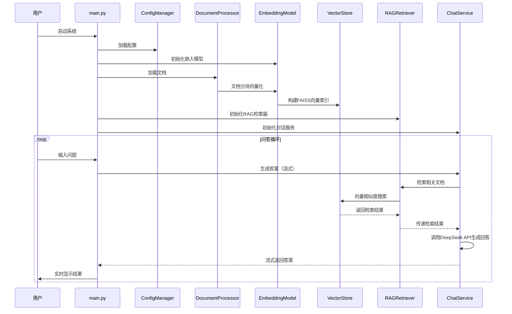

# RAG学习系统 - 简化版技术规格书 (SDD)

**版本**: v1.0  
**日期**: 2025-01-27  
**类型**: 学习项目 - 简化版  
**开发周期**: 1天  

## 1. 项目概述

### 1.1 学习目标
- 掌握RAG（检索增强生成）核心技术原理
- 实践向量数据库和语义检索技术
- 学习大语言模型API集成方法
- 体验端到端RAG系统开发流程

### 1.2 系统简介
基于本地文档的智能问答系统，通过向量检索和大语言模型生成准确回答。

### 1.3 核心技术栈
```yaml
编程语言: Python 3.11+
嵌入模型: 本地bge-small-zh
向量数据库: faiss-cpu
大语言模型: DeepSeek API (deepseek-chat, OpenAI格式调用)
依赖管理: pip + requirements.txt
配置管理: config.yaml + .env (双配置文件)
文档格式: 仅支持.md格式
错误处理: 基础try-catch + 用户友好提示
```

## 2. 系统架构

### 2.1 整体架构
```
用户输入 → 文档处理 → 向量检索 → 答案生成 → 结果输出
    ↓         ↓         ↓         ↓         ↓
  main.py → document → embedding → chat → 命令行显示
```

### 2.2 核心模块设计
```
rag_learning_system/
├── main.py                     # 主程序入口
├── src/
│   ├── config_manager.py       # 配置管理器
│   ├── document_processor.py   # 文档处理模块（Markdown解析、分块）
│   ├── embedding_model.py      # 嵌入模型（SentenceTransformer）
│   ├── vector_store.py         # 向量存储（FAISS索引）
│   ├── retriever.py            # RAG检索器
│   └── chat_service.py         # 对话服务（DeepSeek API集成）
├── data/
│   ├── documents/              # 原始Markdown文档目录
│   └── vectors/                # FAISS向量索引存储
├── tests/                      # 测试文件目录
├── .env                        # 环境变量配置
└── requirements.txt            # 依赖包列表
```

### 2.3 数据流程


## 3. 核心模块详细设计

### 3.1 配置管理模块 (config_manager.py)

#### 功能职责
- 环境变量和配置文件管理
- 配置验证和默认值设置
- 配置信息的统一访问接口

#### 核心接口
```python
class ConfigManager:
    def __init__(self, env_file: str = ".env")
    def load_config(self) -> Config
    def get_embedding_config(self) -> dict
    def get_retrieval_config(self) -> dict
    def get_llm_config(self) -> dict
```

### 3.2 文档处理模块 (document_processor.py)

#### 功能职责
- Markdown文档加载和解析
- 智能文档分块处理（基于标题结构）
- 文档元数据提取和管理

#### 核心接口
```python
class MarkdownDocumentProcessor:
    def __init__(self, chunk_size: int = 1000, chunk_overlap: int = 200)
    def load_document(self, file_path: str) -> str
    def process_document(self, file_path: str) -> List[DocumentChunk]
    def _chunk_markdown_text(self, text: str, metadata: dict) -> List[DocumentChunk]
```

#### 关键数据结构
```python
@dataclass
class DocumentChunk:
    id: str
    content: str
    metadata: dict
    source_file: str
    chunk_index: int
    start_pos: int
    end_pos: int
```

### 3.3 嵌入模型模块 (embedding_model.py)

#### 功能职责
- SentenceTransformer模型加载和管理
- 文本向量化处理
- 批量处理和设备管理

#### 核心接口
```python
class EmbeddingModel:
    def __init__(self, model_name: str, device: str = "cpu")
    def load_model(self) -> None
    def encode_texts(self, texts: List[str]) -> np.ndarray
    def get_embedding_dim(self) -> int
    def is_loaded(self) -> bool
```

### 3.4 向量存储模块 (vector_store.py)

#### 功能职责
- FAISS向量索引构建和管理
- 向量相似度搜索
- 索引的保存和加载

#### 核心接口
```python
class VectorStore:
    def __init__(self, dimension: int)
    def build_index(self, embeddings: np.ndarray, chunks: List[DocumentChunk]) -> None
    def search(self, query_embedding: np.ndarray, top_k: int = 5) -> List[QueryResult]
    def save_index(self, save_path: str) -> None
    def load_index(self, load_path: str) -> bool
```

#### 关键数据结构
```python
@dataclass
class QueryResult:
    chunk_id: str
    content: str
    score: float
    metadata: dict
```

### 3.5 RAG检索模块 (retriever.py)

#### 功能职责
- 整合嵌入模型和向量存储
- 端到端的检索流程管理
- 检索结果的后处理和过滤

#### 核心接口
```python
class RAGRetriever:
    def __init__(self, embedding_model: EmbeddingModel, vector_store: VectorStore)
    def build_index_from_documents(self, chunks: List[DocumentChunk]) -> None
    def search(self, query: str, top_k: int = 5, similarity_threshold: float = 0.0) -> List[QueryResult]
    def save_index(self, save_path: str) -> None
    def load_index(self, load_path: str) -> bool
```

### 3.6 对话服务模块 (chat_service.py)

#### 功能职责
- DeepSeek API集成和调用
- 流式回答生成
- 提示词模板管理和上下文组装

#### 核心接口
```python
class ChatService:
    def __init__(self, config_manager: ConfigManager)
    def generate_answer_stream(self, query: str, retriever: RAGRetriever) -> Iterator[str]
    def build_prompt(self, query: str, context_chunks: List[QueryResult]) -> str
    def call_api_stream(self, prompt: str) -> Iterator[str]
    def health_check(self) -> bool
```

## 4. 配置管理

### 4.1 配置类结构
```python
@dataclass
class Config:
    # 嵌入模型配置
    embedding_model_name: str = "BAAI/bge-small-zh-v1.5"
    embedding_device: str = "cpu"
    
    # 检索配置
    retrieval_chunk_size: int = 1000
    retrieval_chunk_overlap: int = 200
    retrieval_top_k: int = 5
    retrieval_similarity_threshold: float = 0.0
    
    # LLM配置
    llm_model: str = "deepseek-chat"
    llm_api_key: str = ""
    llm_base_url: str = "https://api.deepseek.com"
    llm_max_tokens: int = 2000
    llm_temperature: float = 0.7
    
    # 路径配置
    documents_path: str = "./data/documents"
    vectors_path: str = "./data/vectors"
    
    # 系统配置
    log_level: str = "INFO"
    
    # 向后兼容的属性访问
    @property
    def embedding(self) -> dict:
        return {
            "model_name": self.embedding_model_name,
            "device": self.embedding_device
        }
    
    @property
    def retrieval(self) -> dict:
        return {
            "chunk_size": self.retrieval_chunk_size,
            "chunk_overlap": self.retrieval_chunk_overlap,
            "top_k": self.retrieval_top_k,
            "similarity_threshold": self.retrieval_similarity_threshold
        }
    
    @property
    def llm(self) -> dict:
        return {
            "model": self.llm_model,
            "api_key": self.llm_api_key,
            "base_url": self.llm_base_url,
            "max_tokens": self.llm_max_tokens,
            "temperature": self.llm_temperature
        }
```

### 4.2 环境变量 (.env)
```bash
# DeepSeek API配置
DEEPSEEK_API_KEY=your_api_key_here
DEEPSEEK_BASE_URL=https://api.deepseek.com

# 嵌入模型配置
EMBEDDING_MODEL_NAME=BAAI/bge-small-zh-v1.5
EMBEDDING_DEVICE=cpu

# 检索配置
RETRIEVAL_CHUNK_SIZE=1000
RETRIEVAL_CHUNK_OVERLAP=200
RETRIEVAL_TOP_K=5
RETRIEVAL_SIMILARITY_THRESHOLD=0.0

# LLM配置
LLM_MODEL=deepseek-chat
LLM_MAX_TOKENS=2000
LLM_TEMPERATURE=0.7

# 路径配置
DOCUMENTS_PATH=./data/documents
VECTORS_PATH=./data/vectors

# 系统配置
LOG_LEVEL=INFO
```

## 5. 核心算法实现

### 5.1 文档分块算法
```python
def split_text_by_sentences(text: str, chunk_size: int = 500, overlap: int = 50) -> List[str]:
    """基于句子边界的智能分块"""
    sentences = re.split(r'[。！？\n]', text)
    chunks = []
    current_chunk = ""
    
    for sentence in sentences:
        if len(current_chunk) + len(sentence) <= chunk_size:
            current_chunk += sentence + "。"
        else:
            if current_chunk:
                chunks.append(current_chunk.strip())
            current_chunk = sentence + "。"
    
    if current_chunk:
        chunks.append(current_chunk.strip())
    
    return chunks
```

### 5.2 相似度检索算法
```python
def semantic_search(self, query: str, top_k: int = 5) -> List[SearchResult]:
    """语义检索核心算法"""
    # 1. 查询向量化
    query_vector = self.embed_text(query)
    
    # 2. FAISS检索
    scores, indices = self.index.search(
        query_vector.reshape(1, -1), 
        top_k
    )
    
    # 3. 结果过滤和排序
    results = []
    for score, idx in zip(scores[0], indices[0]):
        if score >= self.similarity_threshold:
            results.append(SearchResult(
                content=self.chunks[idx].content,
                score=float(score),
                metadata=self.chunks[idx].metadata,
                chunk_id=self.chunks[idx].chunk_id
            ))
    
    return results
```

### 5.3 提示词模板
```python
PROMPT_TEMPLATE = """
基于以下文档内容回答用户问题，要求准确、简洁、有条理。

相关文档：
{context}

用户问题：{query}

回答要求：
1. 基于提供的文档内容回答
2. 如果文档中没有相关信息，请明确说明
3. 保持回答的准确性和客观性
4. 使用中文回答

回答：
"""
```

## 6. 主程序流程 (main.py)

### 6.1 系统初始化
```python
def initialize_system():
    """系统初始化流程"""
    # 1. 加载配置
    config = load_config("config.yaml")
    
    # 2. 初始化模块
    doc_processor = DocumentProcessor(config)
    embedding_service = EmbeddingService(config)
    chat_service = ChatService(config)
    
    # 3. 加载文档和构建索引
    documents = doc_processor.load_documents(config.paths.documents)
    chunks = doc_processor.split_documents(documents)
    embedding_service.build_index(chunks)
    
    return doc_processor, embedding_service, chat_service
```

### 6.2 问答循环
```python
def chat_loop(embedding_service, chat_service):
    """主要问答循环"""
    print("RAG学习系统已启动，输入'quit'退出")
    
    while True:
        query = input("\n请输入您的问题: ").strip()
        
        if query.lower() in ['quit', 'exit', '退出']:
            break
            
        if not query:
            continue
            
        try:
            # 检索相关文档
            search_results = embedding_service.search(query, top_k=5)
            
            if not search_results:
                print("抱歉，没有找到相关文档内容。")
                continue
            
            # 生成回答
            answer = chat_service.generate_answer(query, search_results)
            
            # 显示结果
            print(f"\n回答: {answer}")
            print(f"\n参考文档数量: {len(search_results)}")
            
        except Exception as e:
            print(f"处理问题时出错: {str(e)}")
```

## 7. 依赖管理

### 7.1 requirements.txt
```txt
# 核心依赖
sentence-transformers==2.2.2
faiss-cpu==1.7.4
openai==1.3.0
python-dotenv==1.0.0
PyYAML==6.0.1

# 文档处理
PyPDF2==3.0.1
python-docx==0.8.11

# 工具库
numpy==1.24.3
pandas==2.0.3
tqdm==4.65.0
```

### 7.2 安装脚本
```bash
# 创建虚拟环境
python -m venv venv
source venv/bin/activate  # Linux/Mac
# venv\Scripts\activate   # Windows

# 安装依赖
pip install -r requirements.txt

# 下载BGE模型（首次运行时自动下载）
python -c "from sentence_transformers import SentenceTransformer; SentenceTransformer('BAAI/bge-small-zh-v1.5')"
```

## 8. 快速启动指南

### 8.1 环境准备
```bash
# 1. 克隆项目
git clone <project_url>
cd rag_learning_system

# 2. 创建虚拟环境
python -m venv venv
source venv/bin/activate

# 3. 安装依赖
pip install -r requirements.txt

# 4. 配置API密钥
cp .env.example .env
# 编辑.env文件，填入DeepSeek API密钥
```

### 8.2 准备文档
```bash
# 将文档放入data/documents目录
mkdir -p data/documents
cp your_documents.txt data/documents/
```

### 8.3 运行系统
```bash
python main.py
```

## 9. 功能验证

### 9.1 基础功能测试
```python
def test_basic_functions():
    """基础功能验证"""
    # 1. 文档加载测试
    assert len(documents) > 0, "文档加载失败"
    
    # 2. 向量化测试
    test_text = "这是一个测试文本"
    vector = embedding_service.embed_text(test_text)
    assert vector.shape[0] > 0, "向量化失败"
    
    # 3. 检索测试
    results = embedding_service.search("测试问题", top_k=3)
    assert len(results) >= 0, "检索功能异常"
    
    # 4. 生成测试
    if results:
        answer = chat_service.generate_answer("测试问题", results)
        assert len(answer) > 0, "答案生成失败"
    
    print("✅ 所有基础功能测试通过")
```

### 9.2 性能验证
```python
def test_performance():
    """性能指标验证"""
    import time
    
    # 文档加载性能
    start_time = time.time()
    documents = doc_processor.load_documents("./data/documents")
    load_time = time.time() - start_time
    assert load_time < 30, f"文档加载时间过长: {load_time}s"
    
    # 检索性能
    start_time = time.time()
    results = embedding_service.search("测试查询", top_k=5)
    search_time = time.time() - start_time
    assert search_time < 2, f"检索时间过长: {search_time}s"
    
    print(f"✅ 性能测试通过 - 加载:{load_time:.2f}s, 检索:{search_time:.2f}s")
```

## 10. 学习要点总结

### 10.1 RAG核心技术
- **文档处理**: 分块策略对检索质量的影响
- **向量化**: 嵌入模型选择和本地部署
- **检索算法**: 语义相似度计算和阈值设置
- **生成策略**: 提示词工程和上下文组装

### 10.2 工程实践
- **模块化设计**: 单一职责原则的应用
- **配置管理**: 灵活的参数配置方法
- **错误处理**: 基础异常处理机制
- **性能优化**: 缓存和索引优化策略

### 10.3 扩展方向
- 支持更多文档格式（Word、Excel等）
- 实现多轮对话上下文管理
- 添加检索结果重排序算法
- 集成更多嵌入模型选择

## 11. 错误处理策略

### 11.1 基础错误处理原则
- 采用try-catch机制捕获异常
- 提供用户友好的错误提示信息
- 记录关键错误信息用于调试
- 确保系统在错误后能够继续运行

### 11.2 错误处理示例
```python
# 文档加载错误处理
try:
    documents = load_documents(doc_path)
except FileNotFoundError:
    print("❌ 错误：未找到文档目录，请检查路径是否正确")
    return
except Exception as e:
    print(f"❌ 文档加载失败：{str(e)}")
    return

# API调用错误处理
try:
    response = chat_service.generate_answer(query, context)
except ConnectionError:
    print("❌ 网络连接错误，请检查网络设置")
    continue
except Exception as e:
    print(f"❌ API调用失败：{str(e)}")
    continue
```

### 11.3 错误类型定义
- **配置错误**: 配置文件缺失或格式错误
- **文件错误**: 文档文件不存在或格式不支持
- **网络错误**: API调用失败或网络连接问题
- **模型错误**: 嵌入模型加载失败或推理错误

## 12. 常见问题解决

### 12.1 环境问题
```bash
# Python版本问题
python --version  # 确保3.11+

# 依赖安装问题
pip install --upgrade pip
pip install -r requirements.txt --force-reinstall

# 模型下载问题
export HF_ENDPOINT=https://hf-mirror.com  # 使用镜像
```

### 12.2 运行问题
```python
# API密钥问题
# 检查.env文件是否正确配置DEEPSEEK_API_KEY

# 文档加载问题
# 确保data/documents目录存在且包含文档文件

# 内存不足问题
# 减少chunk_size或top_k参数
```

### 12.3 性能优化
```python
# 检索速度优化
config['retrieval']['top_k'] = 3  # 减少检索数量

# 内存使用优化
config['embedding']['max_length'] = 256  # 减少最大长度

# 缓存启用
config['cache']['enabled'] = True  # 启用结果缓存
```

---

**文档状态**: ✅ 已完成  
**适用场景**: RAG技术学习和快速原型开发  
**预计开发时间**: 1天  
**技术难度**: 中等  

这个简化版SPEC专注于RAG核心技术学习，去除了复杂的企业级特性，确保在1天内可以完成开发并深入理解RAG系统的工作原理。